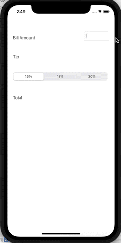

## CodePath-PreWork-Soojin

### App Description
This is a prework assignment for codepath ios development course

### App Walk-though
 

### Required User Stories
* [x] User can enter a bill amount, choose a tip percentage, and see the tip and total values.
* [x] User can select between tip percentages by tapping different values on the segmented control and the tip value is updated accordingly

### Notes

I was able to build settings page but I didn't know how to link user input within settings page to the main calculator. Therefore, I ended deleting the setting page. Throughout the course, I want to learn how to put different pages into communication. 
